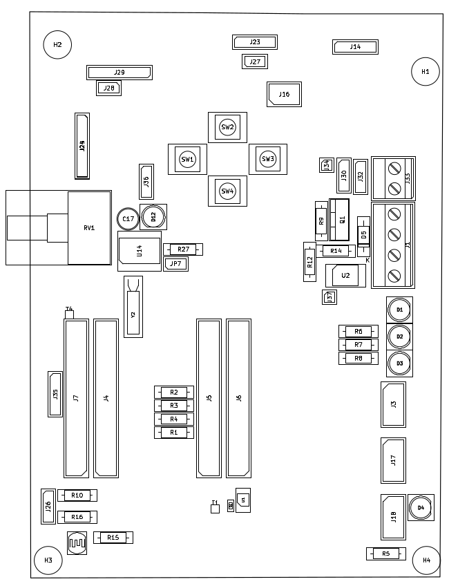

[Revenir sur la page d'accueil](http://github.com/CREPP-PLOEMEUR/crepp.io)

# Instructions de montage

Les instructions de montage concernent la version **1.0**.
Veuillez lire l'ensemble de cette page avant de commencer le montage.

# Liste des composants

| Référence | Quantité | Désignation |
|-----------|----------|-------------|
| R7,R27,R5,R12,R6,R8 | 6 | 270 Ω |
| RV1 | 1 | r_potentiometer |
| R1,R2,R3,R16,R15,R4,R9,R10 | 8 | 10kΩ |
| R11 | 1 | r11 Ω |
| R14 | 1 | 1kΩ |
| D3,D1,D12,D4,D2 | 5 | LED |
| D5 | 1 | D |
| Q1 | 1 | IRF520 |
| J25 | 1 | BME |
| J20 | 1 | GND_Analog |
| J30 | 1 | Servo |
| J13,J15,J17,J3,J18 | 5 | Conn_02x04_Odd_Even |
| J4,J5 | 2 | Right_Connector |
| J19 | 1 | Analog_Inputs |
| J16 | 1 | I2C_Selector |
| J6,J12,J8,J9,J11,J10 | 6 | Right_Connector |
| J7 | 1 | Left_Connector |
| JP7 | 1 | Jumper |
| J33 | 1 | Screw_Terminal_01x02 |
| J23 | 1 | HC-SR |
| J21 | 1 | +3.3V_Analog |
| J35 | 1 | SPI_Connector |
| J29 | 1 | Conn_01x06_Socket |
| J36 | 1 | Power_Selector |
| J24 | 1 | BME_VIRTUAL |
| J26 | 1 | Addr_Selector |
| J37 | 1 | Sig_MOSFET |
| J1 | 1 | Screw_Terminal_01x04 |
| J32 | 1 | Power_Servo_Selector |
| J27 | 1 | SIG_HCSR04 |
| J14 | 1 | OLED_SOCKET |
| J28 | 1 | SIG_HC-05 |
| J34 | 1 | Sig_Servo |
| SW4 | 1 | SW_Down |
| SW2 | 1 | SW_Up |
| T1,T4 | 2 | TestPoint |
| U2 | 1 | PC817 |
| SW3 | 1 | SW_Right |
| U1 | 1 | ADS1115IDGS |
| C17 | 1 | 100nF |
| Y2 | 1 | 16MHz |
| SW1 | 1 | SW_Left |
| C1 | 1 | 100nF |
| U14 | 1 | DS1307+ |

# Plan de montage

# Remarque importante

Lors de la programmation de la carte, il ne faut pas que le Jumper D8 soit placé sur
son emplacement. Ou bien il faut presser le bouton LEFT lors du téléversement.

Ce problème est du au fait que la broche D8 doit être à l'état BAS lors de la programmation 
et que les boutons sont câblés avec une résistance qui impose un niveau HAUT par défaut.

# Remarques générales

On commence par monter les composants du plus bas au plus haut.

C'est à dire que si il y a des composants montés en surfaces (résistances, circuits intégrés, condensateurs...), il vaut mieux les monter 
car les composants plus hauts vont gêner.
On fait généralement les résistances traversantes dans un second ordre.

On termine donc par les grands composants (potentiomètres).
