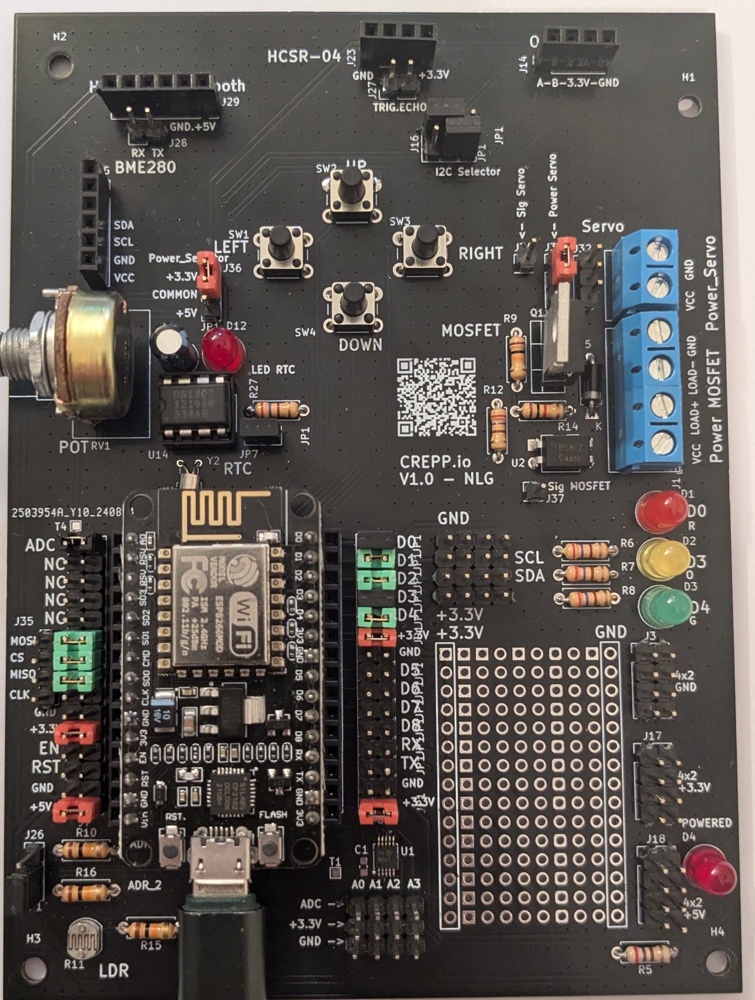

<!-- ATOC -->
# Sommaire

- [CREPP.io](#crepp.io)
  - [Configuration](#configuration)
  - [Montage de la carte](#montage-de-la-carte)
  - [Programmation de la carte](#programmation-de-la-carte)
  - [Fonctions](#fonctions)
  - [Composants](#composants)
  - [Installation et Utilisation](#installation-et-utilisation)
  - [Auteurs](#auteurs)
  - [Remerciements](#remerciements)

<!-- ATOC -->

# CREPP.io 

Ce projet consiste en la conception et la réalisation de cartes d'extension pour différents modules. La carte permet d'étendre les capacités de certains microcontrôleurs en ajoutant divers connecteurs, composants passifs et actifs, facilitant ainsi le développement de projets IoT (Internet des Objets). Elle est conçue pour offrir une interface facile d'utilisation pour la connexion de capteurs, d'afficheurs, de modules de communication, et d'autres périphériques.

Cette carte est le support de l'atelier Electronique Débutant pour le Club de Robotique et d'Electronique Programmable de Ploemeur (CREPP).

## Configuration

Pour programmer les cartes, nous utiliserons le framework **PlatformIO** 

Les instructions sont disponibles [sur cette page](SETUP.md)

## Montage de la carte 

Il convient tout d'abord de repérer le modèle de votre circuit :
Le numéro de version est sous le QRCode.

Les instructions de montage sont disponibles dans les fichiers suivants : 

- [Montage V1.0](PCB/V1.0/Assembly.md) - Version avec ESP12

- [Montage V1.1](PCB/V1.1/Assembly.md) - Version avec ESP12 amelioré

- [Montage V2.0](PCB/V2.0/Assembly.md) - Version avec Raspberry Pi Pico-(W)

## Programmation de la carte 

- [Codes V1.0](Codes/V1.X) - Code pour ESP12

- [Codes V1.0](Codes/V2.X) - Code pour ESP12
## Fonctions

- **Connectivité étendue :** La carte propose plusieurs connecteurs (PinHeaders, Sockets, Bornes à vis) pour l'intégration facile de différents modules et capteurs.
- **Indicateurs visuels :** Des LEDs sont présentes pour indiquer l'état des signaux.
- **Contrôle manuel :** Des boutons-poussoirs permettent d'interagir directement avec la carte, utile pour des actions comme la navigation dans des menus ou la sélection de modes.
- **Horloge en temps réel :** Un module RTC (DS1307) est intégré pour fournir une mesure précise du temps.
- **Isolation et protection :** Un optocoupleur (PC817) est utilisé pour isoler électriquement certaines parties du circuit.

## Composants

- **Module ESP12 NodeMCU / Raspberry Pi Pico W:** Le cœur du projet
- **Convertisseur ADC (ADS1115) :** Permet des mesures analogiques précises.
- **Horloge RTC (DS1307) :** Fournit une temporisation en temps réel pour les applications nécessitant une précision horaire.
- **Optocoupleur (PC817) :** Assure l'isolation électrique entre différentes sections du circuit.
- **Transistor de puissance (IRF520) :** Gère la distribution de puissance pour les composants plus gourmands en énergie.

Le schéma du circuit et le design du PCB sont réalisés avec KiCad, un logiciel libre de conception de circuits électroniques. Les fichiers sources sont disponibles dans le dossier `/kicad_project`.

## Installation et Utilisation

- **Alimentation 5V ou 3.3V** pour la carte
- **Divers capteurs et modules** selon les besoins du projet (OLED, HC-SR04, BME280, etc.)

1. **Assemblez la carte** en soudant les composants selon le schéma fourni.
2. **Connectez le module** à la carte via les connecteurs dédiés.
3. **Branchez vos capteurs et modules** aux connecteurs correspondants (I2C, SPI, Analogiques, etc.).
5. **Téléversez votre code** sur le module ESP12 NodeMCU pour commencer à utiliser la carte d'extension.

Les contributions sont les bienvenues ! Si vous avez des idées d'amélioration ou des correctifs à proposer, n'hésitez pas à soumettre une Pull Request ou à ouvrir une Issue.

## Auteurs

- **LE GUERROUE Nicolas** - Concepteur principal

## Remerciements

Merci à la communauté open-source et aux contributeurs de KiCad pour avoir fourni les outils nécessaires à la réalisation de ce projet.

